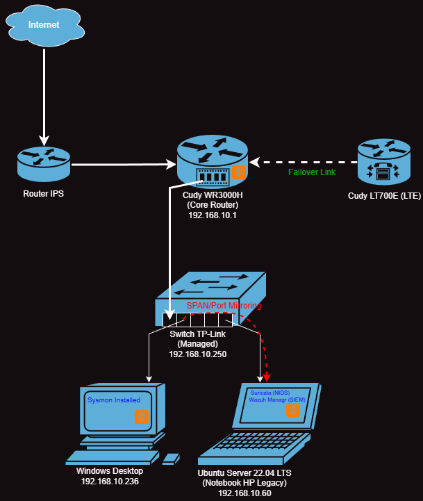

# SOC Defense & Pentest Lab
**Un'infrastruttura reale di monitoraggio, hardening e analisi delle minacce.**

## Obiettivo del Progetto
Questo laboratorio simula un ambiente aziendale reale per l'applicazione pratica di concetti **Blue Team** (Difesa) e **Red Team** (Attacco). L'obiettivo principale è padroneggiare la visibilità di rete, la correlazione dei log e il monitoraggio degli endpoint.

---

## Documentazione Tecnica
Esplora le sezioni dettagliate per approfondire la configurazione:

*  **[Network Architecture](./docs/Network_Architecture.md)**: Dettagli su subnetting, Switch Managed (SPAN) e Failover LTE.
*  **[Hardware Lab Inventory](./docs/Hardware_Lab.md)**: Specifiche del Server SOC (HP), Desktop e Red Team Node (Asus).
*  **[Software Stack](./docs/Software_Stack.md)**: Integrazione SIEM/XDR (Wazuh), IDS (Suricata) e Tool di Pentest.
*  **[Automation & Maintenance](./scripts/soc-cleaner.sh)**: Script Bash per la gestione dei log e l'ottimizzazione delle risorse.

---

## Casi di Studio & Operazioni Pratiche

### Blue Team Ops
* **Active Response (Progetto Yamamoto):** Implementazione del blocco automatico degli IP malevoli tramite Wazuh + Netsh.
* **Thermal & Resource Tuning:** Ottimizzazione del kernel Linux per stabilizzare il server HP (da 80°C a 49°C).
* **FIM (File Integrity Monitoring):** Analisi in tempo reale delle modifiche ai file critici di sistema.

### Red Team Ops
* **[Case Study: Web App Assessment](./docs/Case_Study_Web_App.md):** Analisi reale di una applicazione .NET con scoperta di vulnerabilità **IDOR** e **Stored XSS**.
* **Web Vulnerability Research:** Test di SQL Injection su target controllati tramite Burp Suite.
* **Network Reconnaissance:** Analisi del traffico tramite scansioni Nmap per validare le regole di Suricata.

---
**Autore:** [Andrea Mannoia]  
**Ruolo:** Junior SOC Analyst / Pentester in training
---

---

## Nota Personale
Questo laboratorio non è solo una collezione di strumenti, ma il diario della mia transizione professionale verso la Cybersecurity. 

Ho costruito questa infrastruttura partendo da zero, affrontando sfide reali come l'ottimizzazione termica di hardware legacy e la gestione di protocolli di rete complessi. Per accelerare il mio apprendimento e simulare un ambiente di lavoro moderno, ho utilizzato strumenti di **IA Generativa come Mentore Senior virtuale**, collaborando nella progettazione architettonica e nella stesura dei report tecnici. 

Credo fermamente che l'onestà intellettuale e la capacità di padroneggiare gli strumenti di supporto tecnologico siano skill fondamentali per un analista nel 2026. 
Ogni riga di codice, configurazione o vulnerabilità riportata in questo repository è stata da me testata, risolta e validata fisicamente nel laboratorio.
