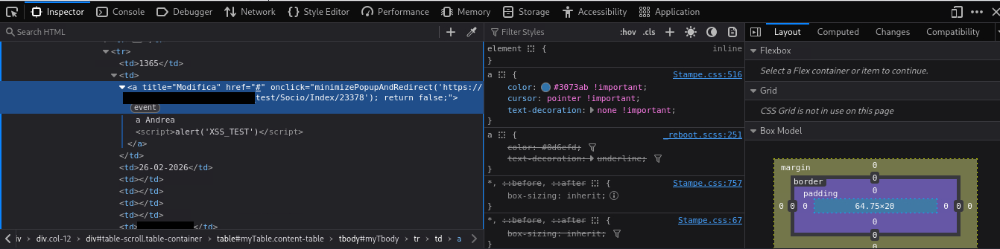
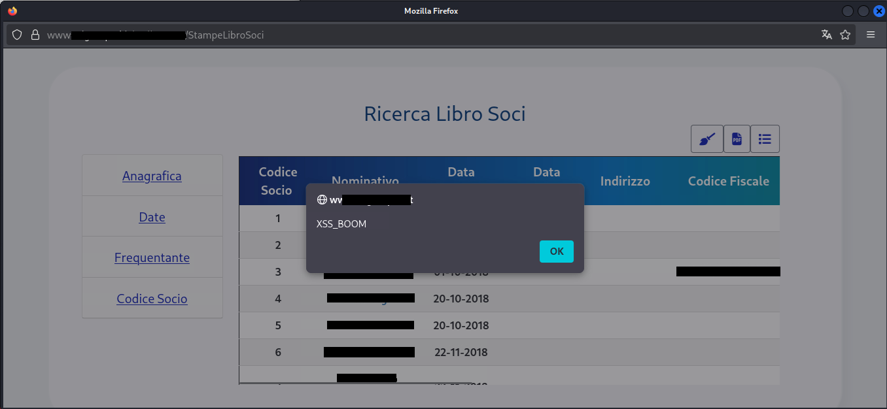

# Case Study: Vulnerability Assessment & Remediation (.NET Core App)

Questo report documenta l'analisi di sicurezza effettuata su una Web Application reale (Management System per palestre), condotta con autorizzazione esplicita.

## Obiettivo e Metodologia
*   **Target:** Applicazione Web basata su .NET Core e relative API.
*   **Metodologia:** **Grey Box Testing**. L'analisi si è concentrata sulla manipolazione delle richieste e sul testing degli endpoint per verificare l'isolamento dei tenant e la robustezza dell'autenticazione.
*   **Tooling:** 
    *   **Burp Suite Professional:** Intercettazione traffico e manipolazione in tempo reale (Repeater).
    *   **Burp Decoder:** Decodifica locale di token e parametri codificati (Base64/URL Encoding) per preservare la riservatezza dei dati.
    *   **Postman:** Testing degli endpoint API, crafting di richieste HTTP personalizzate e analisi delle risposte strutturate (JSON).
    *   **OWASP ZAP:** Scansione passiva, analisi degli header di sicurezza e Fuzzing.

---

## Vulnerabilità Identificate e Mitigazioni

### 1. BOLA / IDOR (Broken Object Level Authorization)
*   **OWASP Category:** [A01:2021-Broken Access Control](https://owasp.org/Top10/A01_2021-Broken_Access_Control/)
*   **Falla:** Manipolando il parametro `idPalestra` nell'URL (es. da 3 a 1), un utente autenticato poteva accedere ai dati sensibili di altre strutture. Il server si fidava dell'input client senza verificare la proprietà della risorsa.
*   **Rischio:** Esfiltrazione massiva del database soci (Data Breach).
*   **Remediation:** Implementazione di controlli di autorizzazione lato server. Suggerito l'uso di identificativi basati sulla sessione protetta (Claims-based) o l'adozione di **GUID** al posto di ID sequenziali.

### 2. Stored XSS (Cross-Site Scripting Persistente)
*   **OWASP Category:** [A03:2021-Injection](https://owasp.org/Top10/A03_2021-Injection/)
*   **Falla:** Mancata sanitizzazione degli input e assenza di Output Encoding nel modulo "Gestione Soci". L'analisi ha seguito un approccio iterativo per bypassare le difese del browser.

#### Fase 1: Test del Payload Standard (Inerte)
Il primo tentativo è stato effettuato con un tag ``

**Esito:** Fallito.
*   **Analisi Tecnica:** Nelle pagine di modifica, il payload veniva inserito nell'attributo `value` di un input text, venendo interpretato come stringa letterale. Nella lista soci, il caricamento tramite **AJAX** impediva l'esecuzione del tag `<script>` per via delle protezioni native dei browser moderni sulla manipolazione dinamica del DOM.

#### Fase 2: Bypass tramite Event Handler Injection (Successo)
Per aggirare le restrizioni sui tag script, è stato utilizzato un payload basato su un **Event Handler** di un elemento non testuale:
`Andrea `

**Esito:** Successo.
*   **Analisi del Bypass:** Invece di caricare un programma esterno, questo payload sfrutta la logica di rendering delle immagini. Impostando una sorgente non valida (`src=x`), il browser scatena l'evento `onerror`. Poiché l'istruzione contenuta nell'handler è JavaScript legittimo, il browser la esegue ignorando i filtri di sicurezza applicati ai caricamenti AJAX.

*Figura 1: Evidenza nel DOM dello script iniettato correttamente nel database.*

*Figura 2: Esecuzione del pop-up JavaScript dopo il bypass delle difese.*

*   **Impatto:** Critico. Un attaccante potrebbe utilizzare questa tecnica per esfiltrare il token JWT dell'amministratore (`document.cookie`) o per effettuare un defacement della pagina.
*   **Remediation:** 
    1. **Input Validation:** Filtrare i caratteri speciali in ingresso.
    2. **Context-Aware Output Encoding:** Utilizzare librerie che codificano i dati in base al contesto HTML (es. trasformando `<` in `&lt;`), impedendo al browser di interpretare i dati come codice.

### 3. Information Disclosure (Verbosity Errors)
*   **OWASP Category:** [A05:2021-Security Misconfiguration](https://owasp.org/Top10/A05_2021-Security_Misconfiguration/)
*   **Falla:** L'invio di dati malformati generava errori HTTP 500 che rivelavano lo Stack Trace, la versione di .NET e ID di richiesta interni.
*   **Rischio:** Agevola la mappatura dell'infrastruttura e la ricerca di exploit mirati.
*   **Remediation:** Configurazione di **Custom Error Pages** per l'ambiente di produzione.

### 4. Clickjacking (Missing Security Headers)
*   **Falla:** Assenza dell'header `X-Frame-Options` in molteplici pagine core.
*   **Rischio:** Un attaccante può caricare l'applicazione dentro un iframe invisibile per indurre l'utente a eseguire azioni involontarie.
*   **Remediation:** Inserimento del middleware per l'invio forzato dell'header `X-Frame-Options: SAMEORIGIN`.

### 5. JWT Token Insecurity
*   **Falla:** L'analisi del token tramite il **Burp Decoder** ha rivelato che il payload esponeva ID sensibili (idSocio, idPalestra) codificati in Base64 e utilizzava parametri di validazione predefiniti.
*   **Rischio:** Facilita attacchi di tipo Replay e la mappatura logica del database per attacchi IDOR mirati.
*   **Remediation:** Offuscamento dei dati sensibili nel payload (o rimozione completa a favore di riferimenti lato server) e personalizzazione dei parametri di validazione.

---

## Conclusione e Impatto
L'analisi ha dimostrato l'importanza di un monitoraggio costante degli endpoint e della validazione degli input. Le mitigazioni suggerite hanno elevato lo standard di sicurezza dell'applicazione, garantendo la conformità ai principi di **Security by Design**.
